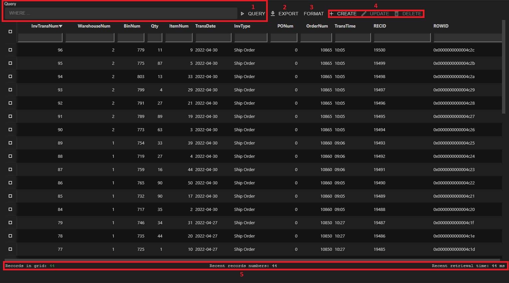

# **ProBro user manual** 
This document provides guidelines how to use ProBro extension.

## **1. Opening ProBro extention:**

 1. ProBro extension image on sidebar.
 2. Create new db connection. 
 3. Refresh db connection list.
 4. Delete existing connection.
 5. Edit existing connection.
 6. Group lists of databases. If no group is asigned to database, group is set to "Empty".

 Every db connection on start of extention or refreshing are testes if they are connected. Otherwise near the Openedge logo appears red sign.

 ## **2. Creating new connection**

 For creating and editing db connections is used same stucture.For editing new tab with selected database information will be displayed.

 

  - **Connection name:** name of your database which will appear in group list.
  - **Group:** name of group where database will be assigned. Default group name is "EMPTY"
  - **Physical name:** location of you databases .db file.
  - **Description:** optional description of db.
  - **Host name:** host of database
  - Port: port for database
  - **User ID** and **password:** optional credentials if needed to connect to database.
  - **Other parameters:** optional credentials if needed to connect database.

  ## **3. Table explorer**
  Once selected database, table list is displayed. 

1. **Filter:** By default only user table are displayed. Use filtering to see other (virtualSystem, schemaTable, SQLCatalog).

2. **Query launch:** table data can be opened by clicking on query button or by double click on table name. Clicking on button won`t trigger fields or indexes explorer to update for selected table.

## 4. Fields and Indexes explorer

  - Select table to see fields and indexes. Fields and Indexes are displayed in panel view. By default, they are on seperate tabs, but can be merged by dragging.

 - In fields explorer has multisorting and multifiltering options.
Multisorting can be used by holding CTRL key and selecting prefered columns. 

- By selecting field rows, query columns can be shown/hidden.

## **5. Query window**

In first launch of query, all records are displayed.

ProBro extension uses server-side multisorting and multifiltering.

1. **Custom query** request can be written to filter records. Query should be formatted like WHERE statement.
2. **Export of records:**
    - formats available for exporting: 
        - JSON;
        - Excel;
        - CSV.
    - The scope for exporting records can be selected:
        - table: export all records. ;
        - Filter: export only filtered records;
        - Selection: export only selected rows of records.
    - When selected table or filter scopes, custom quered data will be exported.
    - Record are exported in user sorted order.
3. **Record display formats:**
    - RAW - Json formatted data;
    - <s>RAW</s> - OE formatted data.
4. **CRUD operations:**
    - CREATE - create record;
    - UPDATE - update record. Available only when there is one selected record.
    - DELETE - deletes one or more selected records.
    - READ - double clicked on record, all details are shown in popup box.
5. **Data retrieval information:** ProBro extention is using lazy loading for better performance with large tables. Information shows current number of records, recent number of records loaded and record retrieval time in ms.