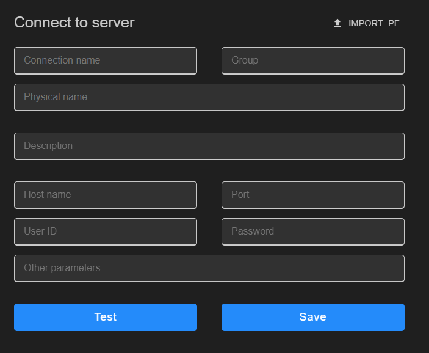

# **ProBro user manual**

This document provides guidelines how to use ProBro extension.

## **1. Opening ProBro extension:**

1.  ProBro extension image on sidebar.
2.  Create new db connection.
3.  Refresh db connection list.
4.  Delete existing connection.
5.  Edit existing connection.
6.  Launch data administration.
7.  Launch data dictionary.
8.  Launch procedure editor.
9.  Refresh single connection.
10. Group lists of databases. If no group is assigned to database, group is set to "Empty".

The icon indicates current status of the connection. Every db connection on the start of the extension or upon refreshing are tested to check if they are connected. Otherwise near the OpenEdge logo a red circle appears which indicates that the connection is unsuccessful (Disabled).

## **2 Creating new connection**

### **2.1 Importing connections through openedge-project.json**

Connections defined in **_openedge-project.json_** are automatically imported in the extension under seperate connections group. **_dbConnections_** Key must be defined for the connections to be imported.

### **2.2 Creating new connection through the extension**

For creating and editing db connections is used same structure. For editing new tab with selected database information will be displayed.

-   **Connection name:** name of your database which will appear in group list.
-   **Group:** name of group where database will be assigned. Default group name is "EMPTY"
-   **Physical name:** location of you databases .db file.
-   **Description:** optional description of db.
-   **Host name:** host of database
-   **Port:** port for database
-   **User ID** and **password:** optional credentials if needed to connect to database.
-   **Other parameters:** optional credentials if needed to connect database.

## **3. Table explorer**

Once the database is selected, table list is displayed. When clicked on the table list view, press CTRL + F for the ability to search for a certain table.

1. **Filter:** By default only user table are displayed. Use filtering to see other (virtualSystem, schemaTable, SQLCatalog).

2. **Query launch:** table data can be opened by clicking on query button or by double click on table name. Clicking on button won`t trigger fields or indexes explorer to update for selected table.

## 4. Fields and Indexes explorer

-   Select table to see fields and indexes. Fields and Indexes are displayed in the panel view. By default, they are on separate tabs, but can be merged by dragging.

-   Fields explorer has multi-sorting and multi-filtering options.
    Multi-sorting can be used by holding CTRL key and selecting preferred columns.

-   By selecting field rows, query columns can be shown/hidden.
    -   RECID, ROWID fields are hidden by default. They can be enabled through the fields explorer.

## **5. Query window**

In first launch of query, all records are displayed.

ProBro extension uses server-side multi-sorting and multi-filtering.

1. **Custom query** request can be written to filter records. Query should be formatted like WHERE statement.
2. **Export of records:**
    - formats available for exporting:
        - JSON.
        - Excel.
        - CSV.
        - dumpFile.
    - The scope for exporting records can be selected:
        - table: export all records. ;
        - Filter: export only filtered records;
        - Selection: export only selected rows of records.
    - When selected table or filter scopes, custom queried data will be exported.
    - Record are exported in user sorted order.
3. **Format:**
    - JSON - JSON formatted data;
    - PROGRESS - OE formatted data.
4. **CRUD operations:**
    - CREATE - create record;
    - UPDATE - update record. Available only when there is one selected record.
    - DELETE - deletes one or more selected records.
    - READ - double clicked on record, all details are shown in popup box.
5. **Data retrieval information:** ProBro extension is using lazy loading for better performance with large tables. Information shows current number of records, recent number of records loaded and record retrieval time in ms.
